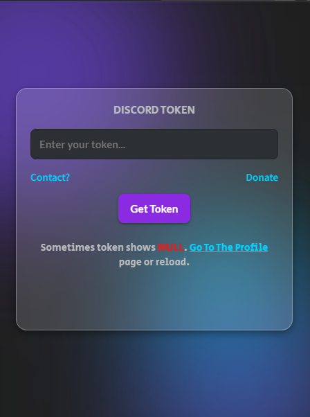

# Discord Token Fetcher Chrome Extension

> **DISCLAIMER**: Accessing user tokens may violate [Discord’s Terms of Service](https://discord.com/terms). This extension is intended for **educational and testing purposes only**. Use at your own risk.

 

## Table of Contents
- [Overview](#overview)
- [Features](#features)
- [Preview](#preview)
- [Installation](#installation)
- [Usage](#usage)
- [Donate](#donate)
- [Contact](#contact)
- [Contributing](#contributing)
- [License](#license)

 

## Overview

This **Chrome Extension** allows you to fetch the currently logged-in Discord user's token directly from the client’s storage. It comes with a **modern, glassmorphism-inspired** UI and **animated background blobs** to showcase advanced CSS techniques.  

**Important**: Extracting tokens can pose security and privacy risks. Always ensure you have permission or use it solely for personal experimentation.

 

## Features
- **Glassmorphism UI** with neon accents and animated backgrounds.
- **Responsive** popup with a fixed dimension to avoid layout issues.
- **Token fetch button** to quickly display the user’s token.
- **Copy to Clipboard** functionality (toggleable).
- **Modern CSS** (variables, keyframe animations, transitions).

 

## Preview

Here’s a small preview of the extension popup (replace with your own screenshot):

 

## Installation

1. **Clone this repository** or [download the ZIP](https://github.com/FlamesIsCool/discord-token-fetcher-extension/archive/refs/heads/main.zip).
2. Extract the folder and ensure the files (`popup.html`, `manifest.json`, etc.) remain in the same directory structure.
3. Open **Google Chrome** and navigate to `chrome://extensions/`.
4. Enable **Developer Mode** (toggle in the top-right corner).
5. Click **Load unpacked** and select the folder containing this extension’s files.
6. The **Discord Token Fetcher** extension should now appear in your extensions list.

 

## Usage

1. **Pin the extension** to your Chrome toolbar if desired.
2. Click on the extension icon to open the popup.
3. Press the **"Get Token"** button.
4. The extension will attempt to retrieve your Discord token.  
   - If successful, the token is displayed or copied to clipboard.
   - If not, it may show `NULL` or an error message. You may need to be on Discord’s web app (`discord.com/channels/@me`) or refresh the page.

 

## Donate

If you find this project helpful or want to support future developments, feel free to **[Donate via Buy Me a Coffee](https://buymeacoffee.com/aura2)**. Your contributions are greatly appreciated!

 

## Contact

For questions, suggestions, or just to say hi:
- **Discord**: [My Discord](https://discord.com/users/1060558266872123454)
- **GitHub**: [FlamesIsCool](https://github.com/FlamesIsCool)

 

 

## License

This project is licensed under the [MIT License](LICENSE).  
Feel free to use, modify, and distribute this project as you wish.  
However, **please note** that any misuse or violation of third-party terms (e.g., Discord’s TOS) is your responsibility.
